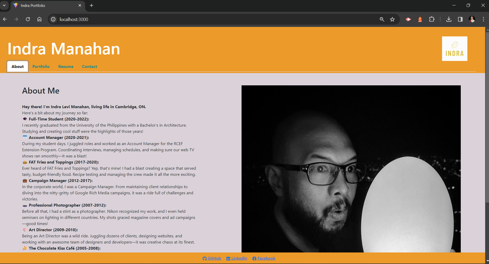
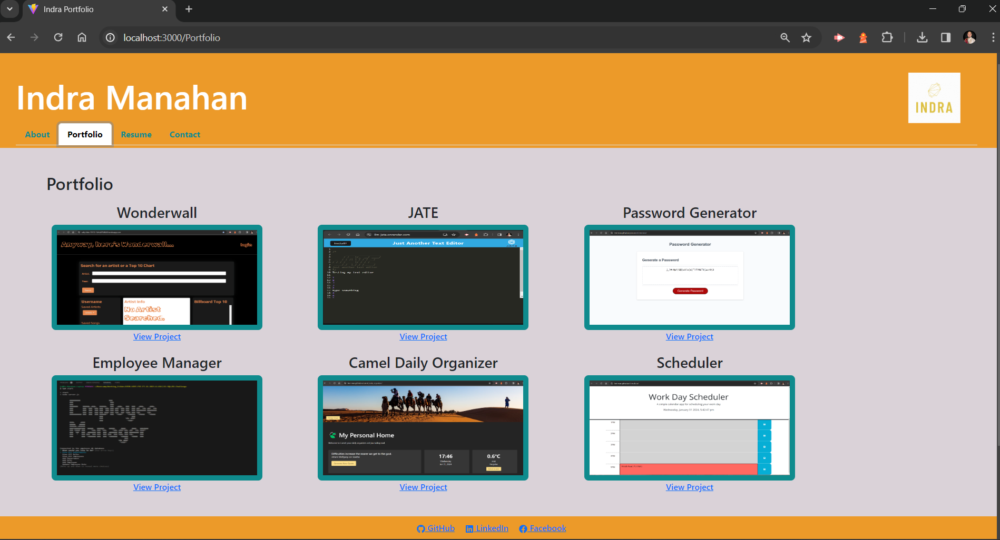
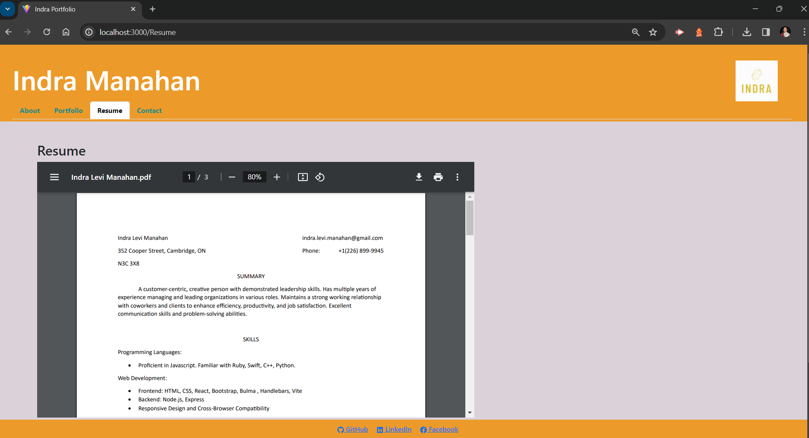
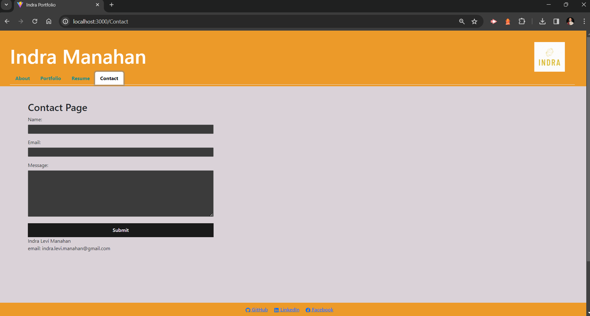

# Indra's React Portfolio

## Description
This is my portfolio built with React.

## Table of Contents

[Installation](#installation)

[Usage](#usage)

[License](#license)

[Contribution](#contribution)

[Tests](#tests)

[Questions](#questions)

[Screenshots](#screenshots)

[Links](#links)

## Installation
Click the link. 

## Usage
User can navigate through the different sections using the nav bar on the top. 
The Portfolio section has links below each image to take user to deployed site or GiHub repo. 
The Resume section has a PDF version of my resume which user can download using the button at the top right of the pdf screen or at the link at the bottom left. 
The Contact page has three input fields for name, email address, and message. The name and email fields prompt the user that this field is required. The email field will validate if the entered information is a valid email address. The contact form currently does not work. 

## License
This project is protected under the MIT license.

## Contribution
Fork my repo and send a pull request.

## Tests
Testing is currently being developed.

## Questions
For any questions or suggestions, please reach me at github.com/Levi-Man or at indra.levi.manahan@gmail.com.

## Screenshots
About Me

Portfolio

Resume

Contact Me

## Links

Deployed site: 

GitHub Repo: 